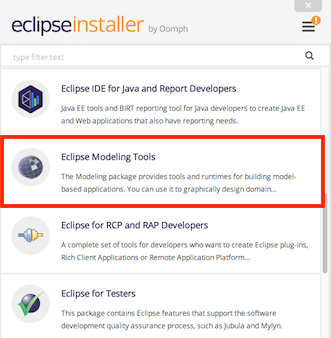

# Installation #
To use PAXelerate you require to install [Eclipse](http://www.eclipse.org) and [OpenCDT](https://bitbucket.org/opencdt/opencdt) beforehand. PAXelerate is compatible with latest Eclipse Version Mars and we highly recommend to use it. 

## 1. Setup ##

* Download the [Eclipse Mars Installer](http://www.eclipse.org/downloads/) and select Eclipse Modelling Tools 



* Upgrade the [EMF Client Platform](http://www.eclipse.org/ecp/download.html) to version 1.7.x 
* [JAVA JDK Version 8 (Java SE Development Kit 8)](http://www.oracle.com/technetwork/java/javase/downloads/index.html)

### Windows ###
* Probably [Git for Windows](http://msysgit.github.io/) is required
* Optional: a Git client, such as [Tortoise Git](https://code.google.com/p/tortoisegit/)    

### Mac ###
* no further tools required

## 2. Install the OpenCDT core plug-ins ##

Once you have started Eclipse, its time to download OpenCDT from the code repository on [Bitbucket](http://bitbucket.org/opencdt/opencdt). 

**Is it not possible to connect to the repository?**
* *Try the following:* 
* Go to *Window -> Preferences -> Team -> Git -> Configuration* and then to *User Settings*. Click *Add Entry*, then enter **http.sslVerify** for the Key and **false** for the value. Then try again to connect to the Git Repository.


* At first, go to *File -> import -> Git -> Projects from Git -> Clone URI* and paste in the following link:
```
#!html
https://bitbucket.org/opencdt/opencdt.git
```
* Select the *Master* branch
* *Import* the following plugins
```
#!html
net.bhl.cdt.client
net.bhl.cdt.model
net.bhl.cdt.model.edit
net.bhl.cdt.ui
```

## 3. Install PAXelerate plugin ##
* Go to *File -> import -> Git -> Projects from Git -> Clone URI* and paste in the following link:
```
#!html
https://github.com/BauhausLuftfahrt/PAXelerate.git
```
* Select the *Master* branch
* *Import* the following plugins
```
#!html

net.bhl.cdt.paxelerate.core
net.bhl.cdt.paxelerate.model
net.bhl.cdt.paxelerate.model.edit
net.bhl.cdt.paxelerate.model.viewmodel
net.bhl.cdt.paxelerate.test
net.bhl.cdt.paxelerate.ui
net.bhl.cdt.paxelerate.util

```

## 4. Launch PAXelerate ##

You can finally start PAXelerate now:

* Expand *net.bhl.cdt.paxelerate.core* from the package explorer tree view
* Right-click *paxelerate.product*
* Select Run as/Eclipse Application

** An error message occurs?** Perhaps not all required plugins are added to working set.
* Select *Run Configurations... -> Plugins*
* In this view, *Add Required Plug-ins* and subsequently *Validate Plug-ins*

### Do you have any troubles? Create a [ticket](https://bauhaus.atlassian.net/secure/CreateIssue!default.jspa) and we give our best to solve your issue. ###


