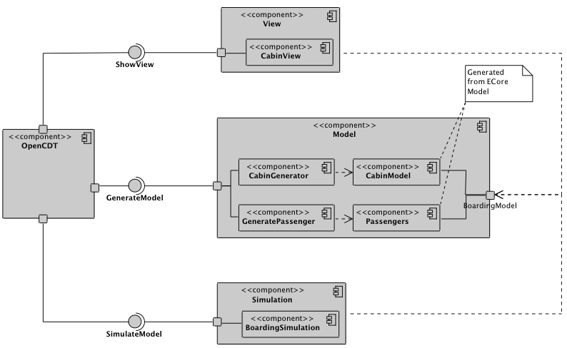
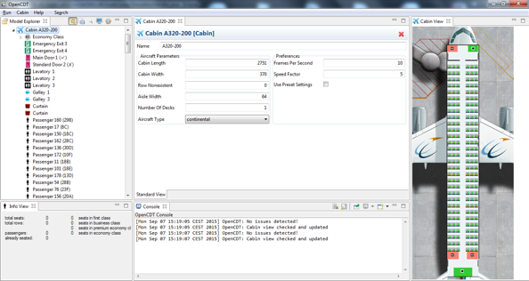
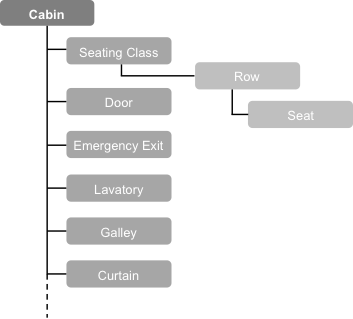
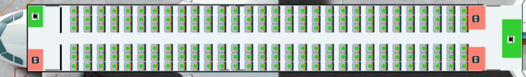
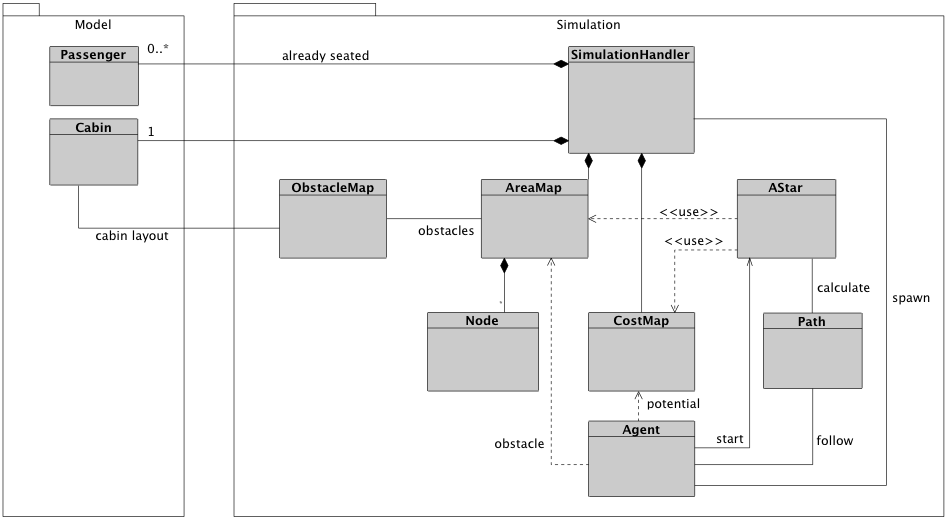
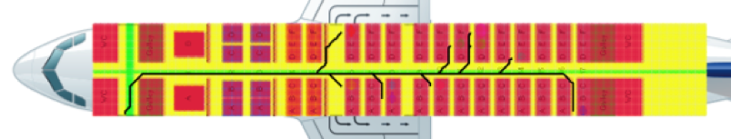

# A Functional Overview

Based on PAXelerate release: Alpha 0.6 (04/01/2016)

PAXelerate is based on a microscopic approach applying agent-based modelling techniques. Each passenger is represented as an agent with individual properties such as body dimensions, walking speed, target seat or type of carry-on luggage.

## PAXelerate - A Functional Overview

* **[Development Platform Fundamentals](#development-platform-fundamentals)**
* **[Cabin Layout Generator](#1-cabin-layout-definition)** 
* **[Agent Builder](#2-agent-builder)**
* **[Agent Based Simulation](#3-agent-based-simulation)**
* **[Post-Processing](#4-data-analysis-and-post-processing)**

## Development Platform Fundamentals

The framework development is based on the [Eclipse Modelling Framework (EMF)](http://www.eclipse.org/ecp/) which is a modelling framework and code generation facility for building tools and other applications based on a structured data model. The core EMF framework includes a meta meta model (ECore) for describing meta models and runtime support for the models. The passenger flow framework builds upon the [OpenCDT framework](https://bitbucket.org/opencdt/opencdt) which uses the EMF framework and provides a graphical user interface (GUI) with adaptable views. OpenCDT is an open source framework for conceptual aircraft design which vision is to enables the integration of design data and functionality from existing software tools, that supports the collaboration between discipline teams and that is flexible enough to be adapted for designing unconventional aircraft concepts.

As you can see simplified in the UML diagram below, the connection between OpenCDT and PAXelerate is enabled using the services *GenerateModel*, *ShowView* and *SimulateModel*. The structure of the cabin and passenger data is generated with the corresponding generator and follows the predefined ECore meta model. The visualisation of the *CabinView* and the post processing results are currently displayed using [Java Standard Widget Toolkit (SWT) framework](https://www.eclipse.org/swt). SWT is an open source widget toolkit designed to provide efficient, portable access to the user-interface facilities of the operating systems on which it is implemented. The *SimulateModel* service triggers the start of the simulation core comprising the path-finding algorithm.

## 1. Cabin Layout Definition ##

The cabin layout generator requires the definition of top-level characteristics, such as the overall cabin length and width and the number of decks. A selection of a predefined aircraft configuration: regional, narrow-body or wide-body aircraft enables the usage of implemented design algorithms which are based on current cabin architectures taking into account rules and regulations. An overview of the graphical user interface you can see below. The model explorer allows to select a cabin monument which properties can be edited in the central view. A rendering of the cabin layout provides a continuously feedback loop.

The cabin consists of seating classes with assigned rows and seats, doors and emergency exist, and all other cabin monuments. This structure is specified in the ECore meta model and can be flexibly adjusted according the requirements of novel architectures. Key characteristics, such as the seat dimensions and pitch, the seat abreast and the number of seats can be defined in the *Seating Class* object. The subordinated objects *Row* and *Seat* inherit the corresponding properties. *Doors* and *Emergency Exits* possess a specific position and width, although the *Lavatories*, *Galleys* and *Curtains* are defined by dimensions in x and y direction. In the case of a multi-deck design, each deck is handled as a separated cabin with ports for passenger exchange, which are represented as stairs or elevators.

A simultaneous update of the graphical visualisation of the cabin layout and executed command in the console view enables short feedback loops during the layout definition. Using the import and export capability, the created architectures can be stored in a repository and shared within the community. An exemplary visualisation of a narrow-body cabin with single-class layout is illustrated below where circles represent occupied seats by agents.

## 2. Agent Builder ##

After the number of passengers is assigned to each cabin class during the cabin layout definition, agent features are set according to the characteristics listed below. The anthropometric properties of waist width, body depth and walking speed are determined using a [Gaussian normal distribution](developer.md/#gaussian-distribution) between minimum and maximum values. The range can be adapted to represent passengers from different regions worldwide. Especially the waist width has a large impact on egress times beside the walking speed. Based on the passengers age, the appropriate walking speed is derived.

| Anthropometrics  | Behaviour  |  
|:---:|:---:|
|  Waist width | Mood: passive/aggressive  |
|  Depth | Hand luggage: small, medium, large  |  
|  Walking speed | Jacket/coat  | 
|   | Entry door  |
|   | Seat  |  

The behaviour properties mainly influence the simulation process. If an agent is assigned an aggressive mood, he tries to overtake other passengers blocking the way in the aisle when there is enough space. In contrast, a passive agent pauses for the blocking passenger to move out of the way, then keeps walking on the calculated path. This enables to model dynamic reactions based on the mood and environment. Thus, agents can be programmed to become impatient when forced to wait for too long and change their mood from passive to aggressive. The entry door marks the starting point and the assigned seat the target.

Optional carried hand luggage has an impact on the walking speed and requires the additional stowing task to be performed before seating. This causes the aisle to be blocked and thus impacts all active agents. Besides the differentiation of whether a passenger carries luggage or not, the type of luggage, namely: small, medium and large items, influences the required stowing times. With these implemented characteristics it becomes feasible to define various passenger's patterns, such as business or leisure travellers.

## 3. Agent-Based Simulation ##

In general, the system behaviour in agent-based simulations is modelled as a collection of autonomous decision-making agents although each agent individually assesses its situation and makes decisions on the basis of a set of rules. The resulting interactions are heterogeneous and can generate network effects. The two dimensional agent-based simulation module is the core of PAXelerate. Agents representing the passengers searching for the shortest and most cost efficient path to their assigned seat using an [A-Star path-finding algorithm](https://en.wikipedia.org/wiki/A*_search_algorithm). Applying parallel thread processing techniques causes the simulation to be non-deterministic as every agent can react independently enabling a realistic agent interaction. Below, the main packages and classes of the agent-based simulation are shown.

The simulation foundation is based on a grid of nodes which is discretised with a default size of 0.1m x 0.1m (3.94in x 3.94in) enabling the agent to move in eight directions. Each node possesses properties such as location, neighbours and occupation status as well as distance and cost which are important during the path finding. The mapping of all nodes is called *Area Map* representing the cabin monuments and agents as obstacles although each node describes the potential of an obstacle. Around the obstacles, a gradient-based potential is defined permitting the agents to walk directly next to the obstacles. A *Cost Map* combines the data of the Area Map with the distance to the target and acts as the walking environment of the Agent. The A-Star path-finding algorithm uses the data of the *Area Map* and the *Cost Map* to find the shortest and most cost efficient *Path* from a starting point to a target. Therefore, the area around the starting point is flooded to determine the cost of each *Node* until the final target is reached. From the target, the path back to the staring point is reconstructed and handed over to the *Agent*.

The *Agent* follows the calculated path and reacts to obstacles occurring on the way to the assigned seat. He/she is able to turn his/her two-dimensional body in 45-degree steps allowing also to step sideways. The *Agent* sends the data of the specific blocked area and the potential around him/her continuously to the *Area Map*, and thus, defines it as obstacles for other agents. For aggressive agents, a new path finding is initiated if a collision on the way to the target occurs. These behaviour patterns are flexible extendable to other situations.

## 4. Data Analysis and Post-Processing ##

During the simulation, the generated data, such as the walking path of each individual passenger or the number waiting passengers in specific area, is recorded. These results are accessible through the meta model structure embedded in the GUI. Below an example depicts the walking paths of ten agents with the cabin Area Map in the background. To allow a further analysis with external software packages like Matlab©, IBM SPSS© or Microsoft Excel©, a data export function is available.

###### Source: Schmidt, M., Engelmann, M., Brügge-Zobel, T., Hornung, M., Glas, M., PAXelerate – An Open Source Passenger Flow Simulation Framework for Advanced Aircraft Cabin Layouts, AIAA SciTech 2016, San Diego, CA, USA

