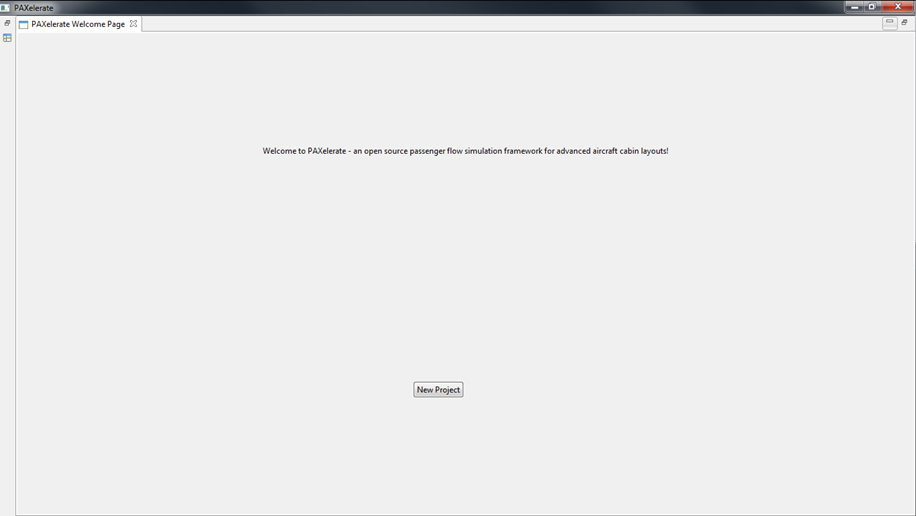
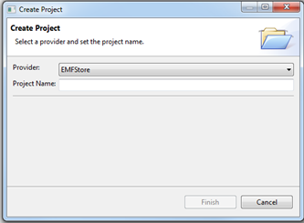
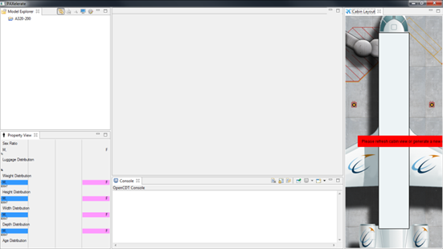
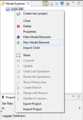
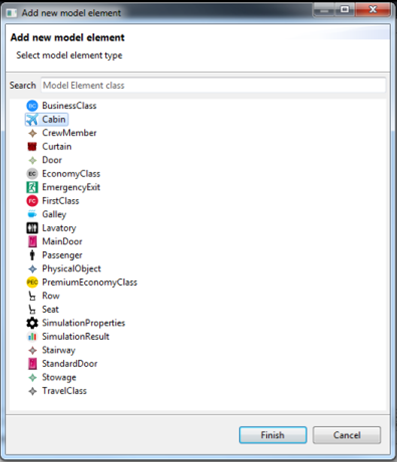
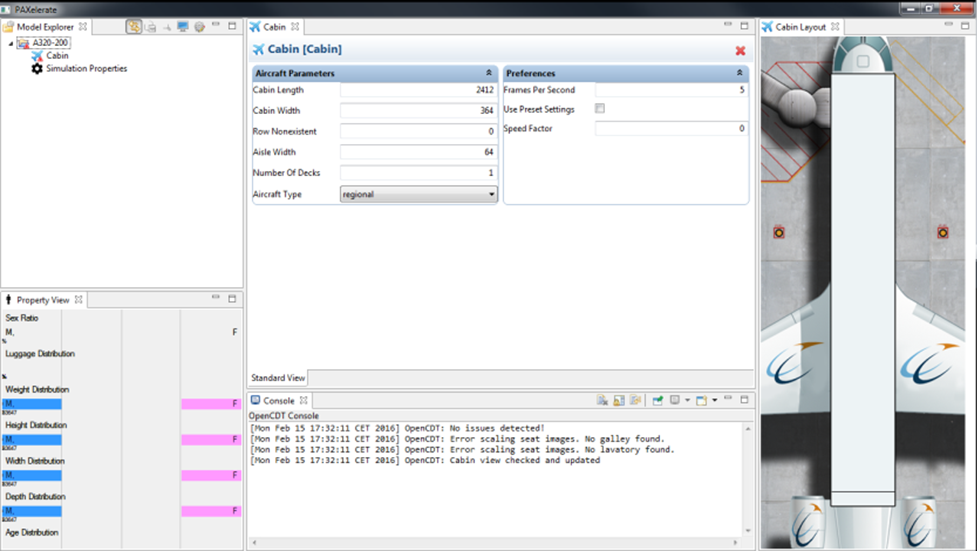
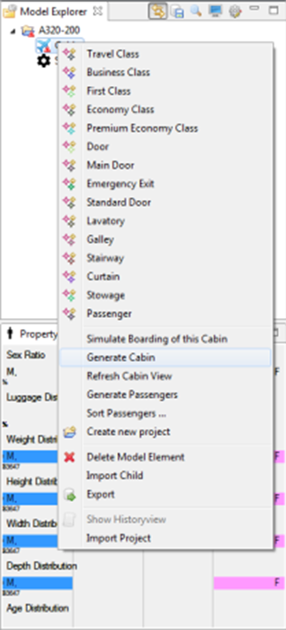
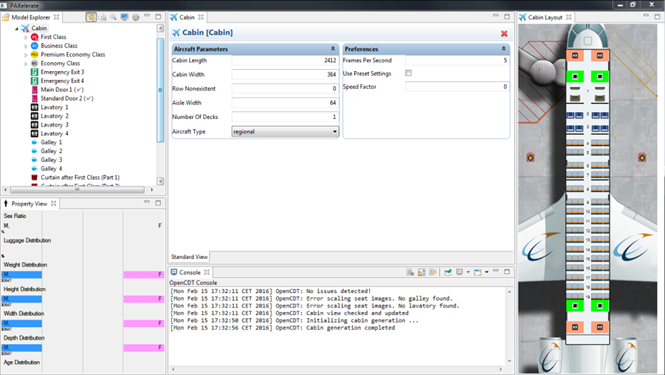

# Tutorial

## First encounter with PAXelerate

After a first launch of PAXelerate the welcome page will greet you. To get started, create a new project and select *EMF Store* as a provider. The general perspective is composed with the model explorer on the left which contains the just created project. The property view underneath contains an overview of the passenger characteristics distribution, such as anthroprometric and luggage parameters. Right now, it is still empty since no passengers are created so far. The console view shows you a history of executed commands and lists warnings if something went wrong. The cabin view on the right will display a rendering of the current cabin layout. The standard view in the middle is currently still empty, it will contain parameters and assigned values for the selected model element.

## Create a cabin layout

You can start to create a new cabin layout with a right click on the aircraft project folder in the model explorer. In the context menu select *New Model Element* which opens a pop-up window with a selection of possible elements. The *Cabin* is the root element and should be created first. The remaining elements are children and can be added in the further course. The standard view displays now the parameter and associated values dived into Aircraft Parameters and Preferences. Additional to the Cabin element, also the Simulation Properties are supplemented.

Using the Generate Cabin function accessible through the context menu applies a predefined algorithm to create a first layout. Further elements, such as Economy Class, Emergency Exit 3 or Lavatory 1, are generated as children of Cabin. The properties of each element are accessible with a double-click which opens another tab on the standard view. The cabin view is updated accordingly and shows you the general arrangement. 

### Import and export of cabin layouts

### Modification of the initial layout

## Generate passengers

### Define passenger properties 

### Sorting algorithms

## Start simulation

## Index and definitions

model explorer
model element
parameters
values

cabin view
console view
property view

seat pitch
seat abreast

