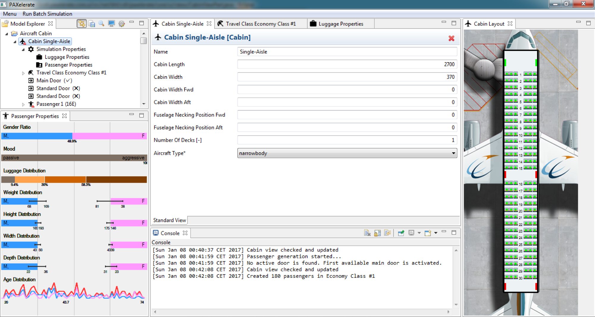
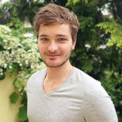
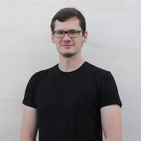

               
An open source passenger flow  simulation framework for advanced aircraft cabin layouts created by [Bauhaus Luftfahrt](http://www.bauhaus-luftfahrt.net). Based on [Eclipse](http://www.eclipse.org) and released under [EPL v1.0](http://www.eclipse.org/legal/epl-v10.html) on [Github](https://github.com/BauhausLuftfahrt/PAXelerate).
               
## Introduction                     
The PAXelerate framework being a two-dimensional agent-based passenger flow simulation is especially designed to assess novel cabin architectures including on-demand adaptable cabins during boarding. Combining the cabin layout designer and agent builder enables to investigate customised case studies. Applying parallel thread processing allows to conduct several trade studies in an efficient manner.                      
                    

                                        
## Feature Overview

Agent-based simulation | Parallel thread processing   
:---: | :---:
The 2D agent-based simulation module is the core of the passenger flow framework where agents represent the passengers searching for the shortest and cost efficient path to their assigned seat using an A-Star path-finding algorithm. Thereby, each agent individually assesses its current situation and makes decisions on the basis of a set of rules, such as stowing luggage or clearing the way for another agent. | Building upon Java as a programming language enables to apply parallel thread processing techniques. Each agent process runs on a single thread within the CPU and thus allows realistic real time agent interaction.

Agent builder | CPACS Support
:---: | :---:
The agents anthropometric properties such as shoulder width, body depth and walking speed, are determined using a normal distribution between minimum and maximum values which can be adapted to reflect different regions worldwide. Dynamic agents reactions are enabled by their mood and environment changes. Optional carried hand luggage has an impact on the walking speed and requires the additional stowing task to be performed before seating. With the implemented characteristics it is feasible to define various passengers patterns, such as business or leisure traveler. | The boarding simulation supports and is based on the [CPACS](www.cpacs.de) file format created by the Deutsches Zentrum für Luft- und Raumfahrt (DLR) as an easy way for interdisciplinary data exchange. PAXelerate supports the import and export of CPACS and a demo file is given for an easy start.

## The PAXelerate  Team
The PAXelerate developer community currently consists of active members from Bauhaus Luftfahrt, Munich Aerospace and Technische Universität München. If you have a question which is not covered in the documentation, please create an issue on our [GitHub page](https://github.com/BauhausLuftfahrt/PAXelerate) or use write an email. Otherwise, feel free to contact us via phone: +49 (0)89 30 74-8490 or email: contact at paxelerate dot com.

 | 
:---: | :---:
Marc Engelmann | Michael Schmidt 
Bauhaus Luftfahrt e.V. | Munich Aerospace 
[Visit ResearchGate profile](https://www.researchgate.net/profile/Marc_Engelmann2) | [Visit ResearchGate profile](https://www.researchgate.net/profile/Michael_Schmidt38)

## Publications
Following is a list of research publications related to PAXelerate. An overview of the PAXelerate research project progess can be found on [ResearchGate](https://www.researchgate.net/project/PAXelerate-An-open-source-passenger-flow-simulation-framework-for-advanced-aircraft-cabin-layouts).

### 2020

* M. Engelmann, T. Kleinheinz, and M. Hornung, [Advanced Passenger Movement Model Depending On the Aircraft Cabin Geometry](https://www.mdpi.com/2226-4310/7/12/182), Aerospace, vol. 7, no. 12, p. 182, Dec. 2020.

* Engelmann, M.; Drust, D.; Hornung, M. (2020): [Automated 3D cabin generation with PAXelerate and Blender using the CPACS file format.](https://publikationen.dglr.de/?tx_dglrpublications_pi1%5bdocument_id%5d=530014) Deutsche Gesellschaft fürLuft- und Raumfahrt - Lilienthal-Oberth e.V.. (Text). https://doi.org/10.25967/530014.

### 2019

* Engelmann, M.; Hornung, M. (2019): [Boarding Process Assessment of the AVACON Research Baseline Aircraft](https://publikationen.dglr.de/?tx_dglrpublications_pi1%5bdocument_id%5d=490049) Deutsche Gesellschaft für Luft- und Raumfahrt - Lilienthal-Oberth e.V.. (Text). https://doi.org/10.25967/490049.

### 2018

* Schmidt, M.: [Ground-Operational Assessment of Novel Aircraft Cabin Configurations](https://mediatum.ub.tum.de/?id=1381821), Dissertation, Technical University of Munich, 2018.

* Schultz, M. and Schmidt, M.: Advancements in passenger processes at airports – An aircraft perspective, Transportation Research Arena (TRA), Vienna, Austria, 2018.

* Yildiz, B., Förster, P., Feuerle, T., Hecker, P., Bugow, S., and Helber, S.: [A Generic Approach to Analyze the Impact of a Future Aircraft Design on the Boarding Process](http://www.mdpi.com/1996-1073/11/2/303), Energies, vol. 11, 2018, p. 303.

### 2017

* Schmidt, M.: [A review of aircraft turnaround operations and simulations](http://www.sciencedirect.com/science/article/pii/S0376042117300039), Progress in Aerospace Sciences, Volume 92, July 2017,
Pages 25-38. doi: 10.1016/j.paerosci.2017.05.002

* Schmidt, M. and Heinemann, P.: [Improving the Boarding Performance of Regional Aircraft](https://arc.aiaa.org/doi/abs/10.2514/6.2017-3424), AIAA Aviation, American Institute of Aeronautics and Astronautics Denver, Colorado, USA, 2017.

* Schmidt, M., Heinemann, P. and Hornung, M.: [Boarding and Turnaround Process Assessment of Single- and Twin-Aisle Aircraft](https://arc.aiaa.org/doi/abs/10.251 /6.2017-1856), 55th AIAA Aerospace Sciences Meeting, American Institute of Aeronautics and Astronautics, Grapevine, Texas, USA, 2017. doi:10.2514/6.2017-1856

### 2016

* Schmidt, M., Engelmann, M., Rothfeld, R. and Hornung, M.: [Boarding Process Assessment of Novel Aircraft Cabin Concepts](http://www.icas.org/ICAS_ARCHIVE/ICAS2016/data/papers/2016_0218_paper.pdf), 30th International Congress of the Aeronautical Sciences (ICAS), Daejeon, South Korea, 2016.

* Schmidt, M., Engelmann, M., Brügge-Zobel, T., Hornung, M., and Glas, M.:
[PAXelerate - An Open Source Passenger Flow Simulation Framework for Advanced Aircraft Cabin Layouts](https://arc.aiaa.org/doi/abs/10.2514/6.2016-1284), 54th AIAA Aerospace Sciences Meeting, American Institute of Aeronautics and Astronautics, San Diego, California, USA, 2016. doi:10.2514/6.2016-1284
